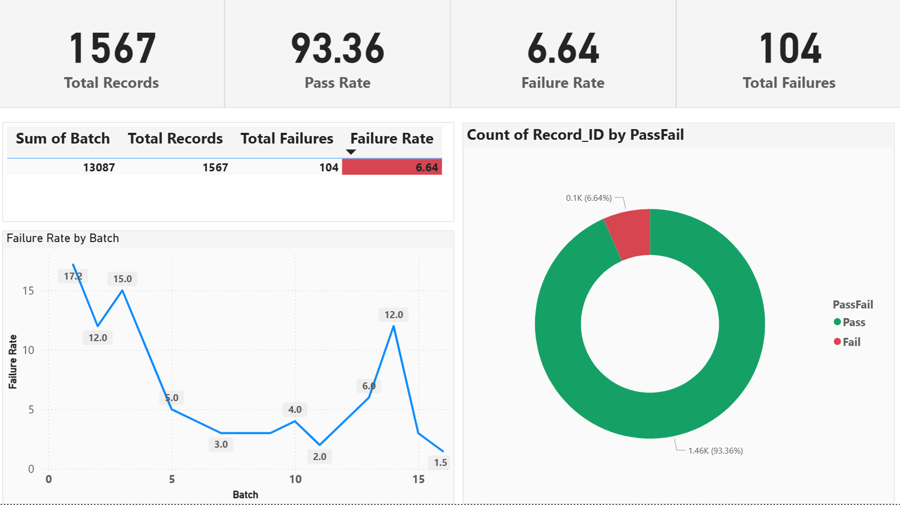
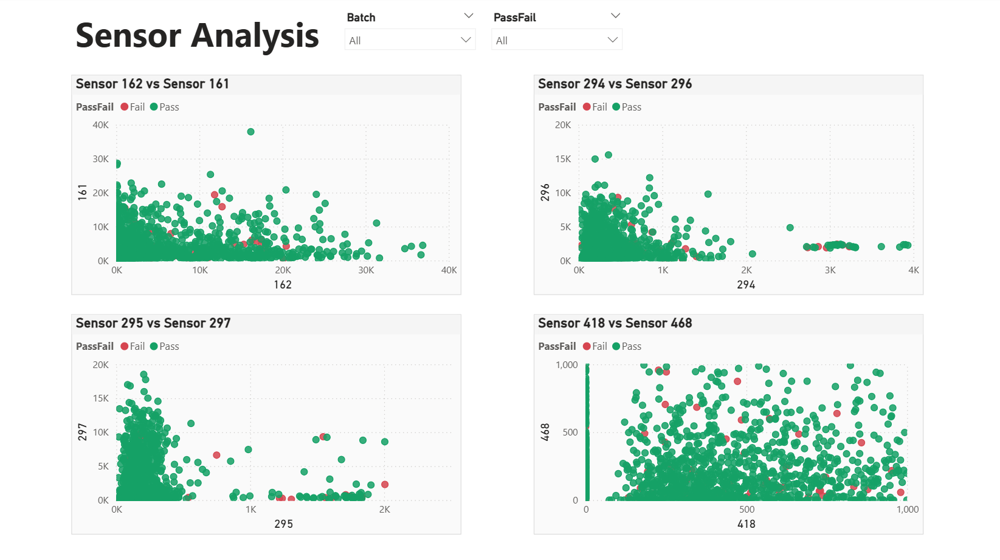

# Semiconductor Manufacturing Performance Analysis

## Project Overview

This Power BI dashboard analyzes semiconductor manufacturing data to find patterns in equipment failures and help predict maintenance needs. I worked with a real dataset of 1,567 production runs to build an interactive tool that could help production teams make better decisions.

## What I Was Trying to Solve

Manufacturing failures are expensive. I wanted to see if I could:
- Figure out which sensor readings actually matter for predicting failures
- Spot patterns in when failures happen (certain batches worse than others?)
- Give manufacturing teams something useful they could actually use

## The Data

I used the SECOM dataset from UCI's Machine Learning Repository. It's real semiconductor manufacturing data with:
- 1,567 production runs
- 591 different sensor measurements (way too many!)
- Pass/Fail results for each run
- About 93% pass rate overall

The data was pretty messy - lots of missing values and sensors that didn't really tell us much.

## What I Did

### Cleaning the Data (Python)

First thing was dealing with the messy data. I wrote a Python script that:
- Got rid of sensors with too much missing data (over 50% missing)
- Filled in the remaining gaps using median values
- Picked out the 30 most useful sensors based on how much they varied
- Grouped the data into batches so I could spot trends

### Building the Dashboard (Power BI)

Then I built an interactive dashboard with two main pages:

**Page 1** shows the big picture - overall pass/fail rates, trends over time, and which batches had issues.

**Page 2** digs into the sensor data with scatter plots that let you see how different sensors relate to each other and whether failed units look different from passed ones.

I used DAX to create measures for things like failure rates and added slicers so you can filter by batch or pass/fail status.

## What I Found

The failure rate sits around 6.6% overall, but that hides some interesting stuff:

- **Batch variation is huge** - some batches fail at 17%, others at only 2%. That's a red flag that something's changing between batches.
- **Certain batches are problem children** - Batches 0, 1, and 14 had way higher failure rates than average
- **Sensor patterns are different for failures** - When you look at the scatter plots, failed units often show up as outliers. Some sensor combinations (like 418 vs 468) really clearly separate the good from the bad.

The batch variation was the biggest surprise to me. It suggests the equipment might need recalibration between batches.

## Dashboard Features

### Performance Overview

The first page gives you the executive summary:
- Key metrics at the top (total runs, pass rate, failure rate)
- A donut chart showing the pass/fail split
- Line chart tracking how failure rates change across batches
- Summary table with the details

### Sensor Analysis

The second page is where you can explore the sensor data:
- Four scatter plots comparing different sensor pairs
- Color coding (green = pass, red = fail) makes patterns easy to spot
- Interactive filters let you drill down into specific batches or just look at failures

You can click on the slicers to filter everything - it's pretty satisfying to watch all the charts update together.

## Tools I Used

- **Python** - pandas and numpy for cleaning and processing the data
- **Power BI** - dashboard creation, DAX for calculations
- **Excel** - initial data exploration

## Files in This Repo

- `Semiconductor_Performance_Analysis.pbix` - The actual Power BI file (download Power BI Desktop to open it)
- `secom_cleaned.csv` - The cleaned dataset
- `clean_secom.py` - My Python cleaning script
- Screenshots of the dashboard

## How to View the Dashboard

1. Download [Power BI Desktop](https://powerbi.microsoft.com/desktop/) (it's free)
2. Download the .pbix file from this repo
3. Open it in Power BI
4. Click around! The slicers make it interactive

## What I Learned

This project taught me a lot about:
- Dealing with real messy manufacturing data
- Making decisions about feature selection (which sensors to keep)
- Building dashboards that are actually useful, not just pretty
- The importance of batch-level analysis in manufacturing

If I were to take this further, I'd probably build a machine learning model to actually predict failures based on the sensor readings. The patterns are definitely there.

## Skills Shown

- Data cleaning and preprocessing
- Feature engineering
- Power BI dashboard development
- DAX calculations
- Data visualization
- Working with manufacturing/process data

---

Built this as a portfolio project to show I can handle real-world data analysis from start to finish. Feel free to reach out if you have questions!

Lee Min Ren  
leeminrens@gmail.com
